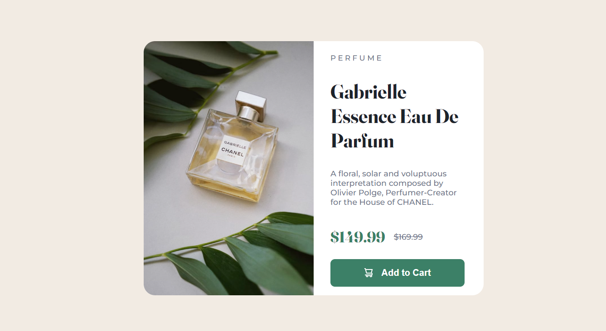
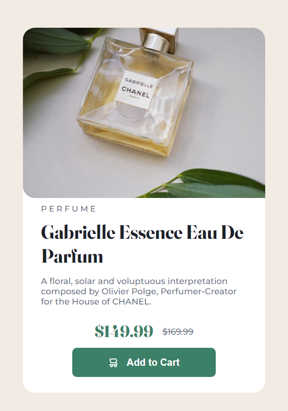

# Frontend Mentor - Product preview card component solution

This is a solution to the [Product preview card component challenge on Frontend Mentor](https://www.frontendmentor.io/challenges/product-preview-card-component-GO7UmttRfa). Frontend Mentor challenges help you improve your coding skills by building realistic projects.

## Table of contents

- [Overview](#overview)
  - [The challenge](#the-challenge)
  - [Screenshot](#screenshot)
  - [Links](#links)
- [My process](#my-process)
  - [Built with](#built-with)
  - [What I learned](#what-i-learned)
  - [Useful resources](#useful-resources)
- [Author](#author)

## Overview

### The challenge

Users should be able to:

- View the optimal layout depending on their device's screen size
- See hover and focus states for interactive elements

### Screenshot




### Links

- Solution URL: [https://github.com/DuduRamone/product-card](https://github.com/DuduRamone/product-card)
- Live Site URL: [https://duduramone.github.io/product-card/](https://duduramone.github.io/product-card/)

## My process

### Built with

- Semantic HTML5 markup
- CSS custom properties
- Flexbox
- Mobile-first workflow

### What I learned

From this experience, I have learned and improved some of my coding skills, such as HTML semantics, CSS proprieties and a few things about how develope responsive websites.

```html

```

```css
@media only screen and (max-width: 600px) {
  [...]
}
```

### Useful resources

- [Srcset: Trabalhando com imagens responsivas](https://www.alura.com.br/artigos/srcset-trabalhando-imagens-responsivas?gclid=CjwKCAiAuOieBhAIEiwAgjCvcpXByHu7gMcjnycMRENbdlq8R7zyG8H5i7ZrDzvoPYKx1FoNYsZd2RoCnsQQAvD_BwE) - This helped me to understand about responsive images.

## Author

- Website (github) - [Eduardo Ramone](https://github.com/DuduRamone)
- Frontend Mentor - [@DuduRamone](https://www.frontendmentor.io/profile/@DuduRamone)
- Twitter - [@duduramone2](https://www.twitter.com/duduramone2)
